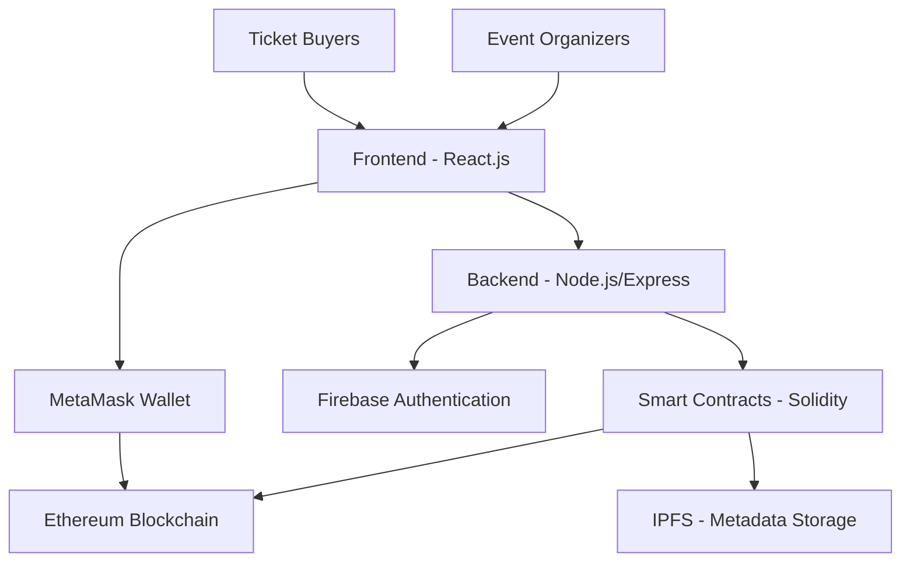

# 🎫 **Blockfest** - Revolutionary Blockchain Ticketing Platform

<div align="center">

🎵 **BLOCKFEST** 🎵

*Transforming the concert and event ticketing industry through blockchain technology*

**React.js | Solidity | Ethereum | Node.js | Smart Contracts**

</div>

## 🌟 **What is Blockfest?**

Blockfest is a **revolutionary blockchain-powered ticketing platform** that eliminates fraud, scalping, and counterfeit tickets from concerts and events. By leveraging **NFT technology** and **smart contracts**, we create a secure, transparent, and user-friendly ecosystem for both event organizers and attendees.

### ✨ **Key Features**

🔐 **Anti-Fraud Protection** - Every ticket is a unique NFT, impossible to counterfeit  
🚫 **Scalping Prevention** - Smart contracts prevent unauthorized reselling  
📱 **Digital QR Tickets** - Instant ticket generation with QR codes  
🔥 **VIP Insider Access** - Exclusive early access for verified members  
💎 **Stake-to-Validate** - Community-driven ticket validation system  
🛡️ **Sybil Protection** - Advanced algorithms prevent fake accounts  

## 🏗️ **Architecture Overview**



## 🚀 **Technology Stack**

### **Frontend Technologies**
| Technology | Purpose | Version |
|------------|---------|---------|
| **React.js** | UI Development Framework | ^18.0.0 |
| **Tailwind CSS** | Utility-first CSS Styling | ^3.0.0 |
| **Framer Motion** | Animations & Transitions | ^10.0.0 |
| **Ethers.js** | Blockchain Connectivity | ^6.0.0 |
| **Firebase Auth** | User Authentication | ^9.0.0 |

### **Backend Technologies**
| Technology | Purpose | Version |
|------------|---------|---------|
| **Node.js** | Runtime Environment | ^18.0.0 |
| **Express.js** | Web Server Framework | ^4.18.0 |
| **Firebase Admin SDK** | Server-side Firebase | ^11.0.0 |

### **Blockchain Technologies**
| Technology | Purpose | Network |
|------------|---------|---------|
| **Solidity** | Smart Contract Language | Ethereum |
| **ERC-721** | NFT Standard Implementation | Mainnet/Testnet |
| **Foundry** | Development & Testing | Local/Testnet |
| **OpenZeppelin** | Secure Contract Templates | All Networks |

## 📋 **Smart Contract Architecture**

### **Core Contracts**

```solidity
📁 src/contracts/
├── 🎫 TicketNFT.sol          # NFT minting and management
├── 🎪 EventManager.sol       # Central event controller
├── ⚡ ValidatorPoS.sol       # Proof-of-Stake validation
├── 🛡️ SybilGuard.sol         # Anti-sybil protection
├── 💰 Staking.sol            # Staking with slashing
└── 🚀 Deploy.s.sol           # Deployment scripts
```

**TicketNFT.sol** - Mints unique NFT tickets, implements transfer restrictions, generates QR codes  
**EventManager.sol** - Creates and manages events, handles ticket sales  
**ValidatorPoS.sol** - Community validation with staking rewards and slashing  

## 🛠️ **Installation & Setup**

### **Prerequisites**
```bash
Node.js >= 18.0.0
npm >= 8.0.0
Git >= 2.30.0
MetaMask Browser Extension
```

### **Quick Start Guide**

#### **1. Clone the Repository**
```bash
git clone https://github.com/your-org/blockfest.git
cd blockfest
```

#### **2. Install Dependencies**
```bash
# Install root dependencies
npm install

# Install frontend dependencies
cd blockfest-ui
npm install

# Install backend dependencies
cd ../backend
npm install

# Install smart contract dependencies
cd ../
forge install
```

#### **3. Environment Configuration**
```bash
# Copy environment templates
cp .env.example .env
cp blockfest-ui/.env.example blockfest-ui/.env
cp backend/.env.example backend/.env
```

#### **4. Configure Environment Variables**
```env
# .env (Root)
PRIVATE_KEY=your_wallet_private_key
INFURA_API_KEY=your_infura_key
ETHERSCAN_API_KEY=your_etherscan_key

# blockfest-ui/.env
REACT_APP_FIREBASE_API_KEY=your_firebase_key
REACT_APP_CONTRACT_ADDRESS=deployed_contract_address
REACT_APP_NETWORK_ID=11155111

# backend/.env
FIREBASE_ADMIN_SDK=path_to_firebase_admin_sdk.json
PORT=5000
MONGODB_URI=your_mongodb_connection_string
```

#### **5. Deploy Smart Contracts**
```bash
# Compile contracts
forge build

# Deploy to Sepolia testnet
forge script script/Deploy.s.sol --rpc-url sepolia --broadcast --verify

# Or deploy locally for development
anvil # In one terminal
forge script script/Deploy.s.sol --rpc-url localhost --broadcast # In another
```

#### **6. Start Development Servers**
```bash
# Terminal 1: Backend server
cd backend
npm run dev

# Terminal 2: Frontend development server
cd blockfest-ui
npm start

# Terminal 3: Local blockchain (if testing locally)
anvil
```

## 🧪 **Testing**

### **Smart Contract Tests**
```bash
# Run all contract tests
forge test

# Run with verbose output
forge test -vvv

# Generate coverage report
forge coverage
```

### **Frontend Tests**
```bash
cd blockfest-ui
npm test

# Run with coverage
npm test -- --coverage
```

### **Backend Tests**
```bash
cd backend
npm test
```

## 📊 **Project Structure**

```
blockfest/
├── 📁 backend/                 # Node.js/Express backend
│   ├── 📁 controllers/         # API route controllers
│   ├── 📁 middleware/          # Custom middleware
│   ├── 📁 routes/              # API routes
│   └── 📄 server.js            # Main server file
├── 📁 blockfest-ui/            # React frontend
│   ├── 📁 src/
│   │   ├── 📁 components/      # React components
│   │   ├── 📁 pages/           # Page components
│   │   ├── 📁 services/        # API services
│   │   └── 📄 App.js           # Main App component
├── 📁 src/                     # Smart contracts
│   ├── 📄 TicketNFT.sol        # NFT ticket contract
│   ├── 📄 EventManager.sol     # Event management
│   ├── 📄 ValidatorPoS.sol     # Validator system
│   └── 📄 SybilGuard.sol       # Anti-sybil protection
├── 📁 script/                  # Deployment scripts
├── 📁 test/                    # Contract tests
└── 📄 foundry.toml             # Foundry configuration
```

## 🤝 **Contributing**

We welcome contributions! Here's how to get started:

1. **Fork the Repository**
2. **Create a Feature Branch**: `git checkout -b feature/amazing-feature`
3. **Make Your Changes** and add tests
4. **Test Your Changes**: Run `npm test` and `forge test`
5. **Submit a Pull Request** with a clear description

### **Contribution Guidelines**
- Follow existing code style and formatting
- Add tests for new functionality
- Update documentation as needed
- Use conventional commit format

## 📈 **Roadmap**

### **Phase 1: Foundation (Q2 2025)** ✅
✅ Core smart contract development  
✅ Basic NFT ticket minting  
✅ React frontend setup  
✅ Firebase authentication integration  

### **Phase 2: Core Features (Q3 2025)** 🚧
🚧 Advanced ticket validation  
🚧 VIP insider system  
🚧 QR code generation  
🚧 Mobile app development  

### **Phase 3: Scaling (Q4 2025)** 📋
📋 Multi-chain support (Polygon, BSC)  
📋 Advanced analytics dashboard  
📋 Bulk ticket operations  
📋 Load balancing  

## 🔒 **Security**

### **Smart Contract Security**
- Access control with role-based permissions
- Reentrancy protection using OpenZeppelin
- Input validation and proper error handling

### **Backend Security**
- Rate limiting on API endpoints
- Input validation and sanitization
- Environment variable protection

### **Frontend Security**
- Content Security Policy implementation
- Secure environment variable handling
- No sensitive data exposure

## 📚 **Additional Resources**

### **Documentation**
- [Solidity Documentation](https://docs.soliditylang.org/)
- [React Documentation](https://reactjs.org/docs/)
- [Foundry Book](https://book.getfoundry.sh/)
- [Ethers.js Documentation](https://docs.ethers.io/)

### **Community**
- [Discord Server](https://discord.gg/blockfest)
- [Telegram Group](https://t.me/blockfest)
- [Twitter](https://twitter.com/blockfest)

## 📄 **License**

This project is licensed under the **MIT License** - see the [LICENSE](LICENSE) file for details.

## 🙏 **Acknowledgments**

Special thanks to:
- **OpenZeppelin** for secure smart contract templates
- **Foundry** team for excellent development tools
- **React** and **Firebase** communities
- **Ethereum Foundation** for blockchain infrastructure
- **Our beta testers** and contributors

<div align="center">

**Built with ❤️ by the Blockfest Team (Devesh Rawat , Sidhart Negi , Pranay Bisht , Saloni Singhal , Shubham Dabas )**

🌟 **Star this repository if you found it helpful!** 🌟

</div>
